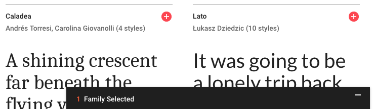
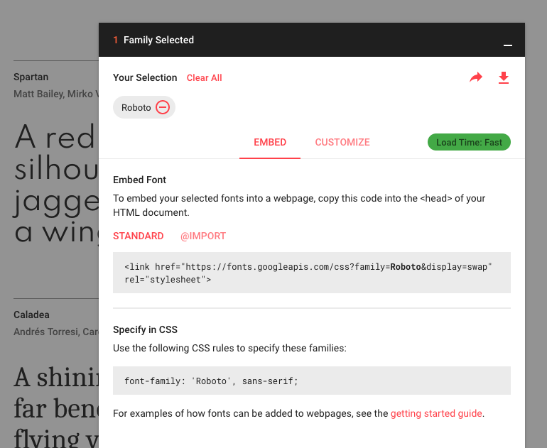

## basic

## Google Web Fonts の導入方法

- [Google Fonts](https://fonts.google.com/)

CSS を数行書くだけで，上記サイトから好きな Web フォントを利用することができる．

### URL の取得

1．[Google Fonts](https://fonts.google.com/) を開き，フォントを検索．
2．使いたいフォントの右上の `+` ボタンを押す．


3．ページ右下に `1 Family Selected` というタブが表示される．



4．3 のタブをクリックすると，

- フォントの URL（`STANDARD` と `@IMPORT` のどちらかを選択．ここでは CSS の `@import` を利用する）
- CSS 上における，選択したフォントの設定

が現れるため，それらをコピーする．



5．CSS ファイルに貼り付ける（後述）

### コード

- フォーマット

`@import url("[web font url]")` とそれを使うための宣言（CSS の `font-family`）が必要．

```css
@import url("[web font url]");

[element, id, class-name] {
  fort-family: "[font name]";
}
```

- 例

```css
@import url("https://fonts.googleapis.com/css?family=Overpass");

/* 全体 */
body {
  font-family: "Overpass";
  font-size: 40px;
}

/* 一部（ここでは id 属性） */
#my-text {
  font-family: "Overpass";
  font-size: 40px;
}
```
